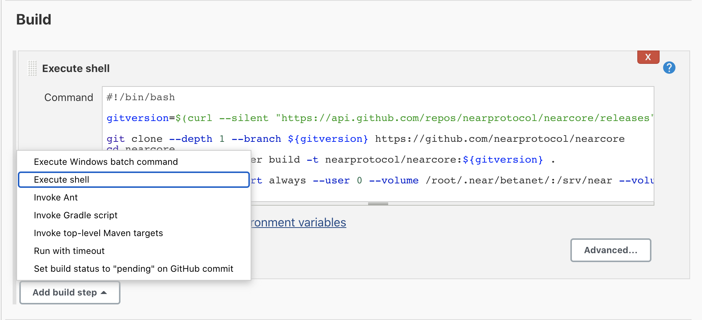

# Near-Jenkins

## Overview

 [NEAR Protocol](https://near.org/) is a decentralized application platform that is secure enough to manage high value assets like money or identity and performant enough to make them useful for everyday people, putting the power of the Open Web in their hands.
 
 [Jenkins](https://www.jenkins.io/) is an open source automation server which enables developers around the world to reliably build, test, and deploy their software.
## Install Jenkins On Ubuntu Node
  ##### 01.Install java
    sudo apt update 
    sudo apt isntall openjdk-8-jdk

  ##### 02.Add the Jenkins Debian repository.
    sudo apt update
    wget -q -O - https://pkg.jenkins.io/debian/jenkins.io.key | sudo apt-key add -
    sudo sh -c 'echo deb http://pkg.jenkins-ci.org/debian-stable binary/ > /etc/apt/sources.list.d/jenkins.list'
  ##### 03.Install Jenkins.
    sudo apt update
    sudo apt install jenkins
## NEARCore Docker Deploy
####    01.Install Docker  
    sudo apt-get update
    sudo apt install docker.io
####    02.Create Jenkins freestyle project NearCoreBetaNet-Deploy
    Jenknis > New Item > Freestyle Project
   add [bash script](https://github.com/minstr22/nearcore-ci-cd/blob/master/Scripts/NearCoreBetaNet-Deploy.sh) as a build step "Execute shell" and than run build. now
   

and thats for testnet

#!/bin/bash
docker=$(docker images | grep -e -rc | awk '{print $2}')
for git in $(curl --silent "https://api.github.com/repos/nearprotocol/nearcore/releases" | grep -Po '"tag_name": "\K.*?(?=")' | grep rc | head -1)
do
   if	[ $git == $docker ]; then
        echo "Tag already deployed"
		
        else
        git clone --depth 1 --branch ${git} https://github.com/nearprotocol/nearcore
        cd nearcore
        DOCKER_BUILDKIT=1  docker build -t nearprotocol/nearcore:${git} .
        fi
        done

## Prometheus and Grafana
[Prometheus](https://prometheus.io/) is installed on startup to expose metrics for the NEAR validating node and the system. [Grafana](https://grafana.com/) is installed to help vsualize these metrics with a dashboard that is customized to show relevant metrics for NEAR validating nodes. The majority is configured and can be accessed by :3000 and default username and password is admin admin.

This was Near's Stake Wars Challenge 3 and a few great tutorials in various languages can be found [here](https://github.com/nearprotocol/stakewars/blob/master/challenges/challenge003.md/) 

## Warchest Bot
Create's a warchest of staked tokens, and dynamically maintains no more than one seat. This is designed to monitor the minimum stake to become a validator, and dynamically manage your staking pool.

This was Near's Stake Wars Challenge 4 and utilizes a package built by me (https://github.com/minstr22/Near-warchest) more information can be found [here](https://github.com/nearprotocol/stakewars/blob/master/challenges/challenge004.md/)

Note: Currently the user would have to ssh into the validator machine and login to NEAR near login for the Warchest bot to operate correctly

## Automaticly Update NEARCore
####    Create Jenkins freestyle project NearCoreBetaNet
    Jenkins > New Item > Freestyle Project
   add [bash script](https://github.com/minstr22/nearcore-ci-cd/blob/master/Scripts/NearCoreBetaNet.sh) as a build step "Execute shell".
   Build Trigger must be "Build periodically": */25 * * * * . To check new release in every 25 minutes
    

## License

This project is licensed under the MIT License - see the [LICENSE](LICENSE) file for details.
